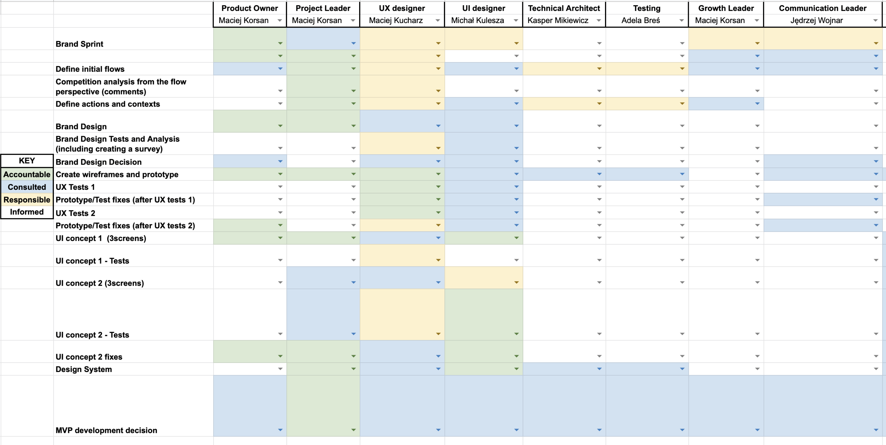

# WORKING WITH EYEDEA 101 

Our collaboration is based on these fundamentals: 

- Transparency
- Open communication
- Product-oriented thinking

The document you're reading is a schema of our typical product development project. It is inspired by the launch list of NASA's countdown procedure for rockets 🚀.

## Project timeline

### 1. Before the project (3-5 days)

- 📅  Initial meeting (1-2h) - project scope & needs description
- 📦  Send us all specifications/files/designs - everything that might be useful - hello@eyedea.io
- ⏳  Project estimation (3-5 days) - we may ask some questions to have a better understanding of the product
- 🧑‍🚀  Crew selection 
- 📩  E-mail message with our vision of your product development with some numbers 

### 2. FINAL GO / NO-GO 

At this point, both sides need to decide if we're starting the cooperation. 

- 📅  Decision meeting (1-2h)

If *GO* - agreement, type of cooperation (time & material / fixed price), start date, go to Project kickoff 🚀

If *NO-GO* - see you next time! 👋

### 3. Project kickoff 🚀 (start date)

Let's do this!

- #️⃣  Slack channel setup - all communication goes there - main rule: **don't use private messages** 
- 📅  Team & project introduction meeting (1h)
- 🛠  Tools access/setup - both sides provide a list of people & tools (we're creating accounts if needed)
- 🗓  Project plan (depends on the size of the project, around 3days)
- 💻 Decision on the releasing system - both parties agree:
  - How the application will be versioned considering milestones, features and bugfixes
  - What is the release timeframe for new scenarios and features

### 4. Plan-execution-measure loop

We're splitting the project into smaller parts (scenarios), each chunk is planned individually

- 📅  Scenario planning (1h)
- 💻  Scenario execution - development / design 
- 🔎  Scenario measurement

### 5. After the project

- 📅  Project retrospective meeting (2h)
- 🍻  Success celebration - end of the project 🎉

## Project execution details

During the product development you'll get: 

- 📩  Weekly summary of project progress with hour reports and most exciting updates (single e-mail)
- 💻  Access to designs & code
- ⏰  Access to hour reports

### Method & responsibility distribution

We're building things with our method called Flow. It's scenarios based way of describing your product, and it's understandable by every team member (including you). We're happy to tell you more about it - don't hesitate to ask!

Every team member has a certain role and responsibility. We're using a clear responsibility matrix for that.

### Tech & tools

Our main design tool is *Figma*, our tech stack is react (with typescript), node, nest.js, and various cloud platforms. We're multidisciplinary team, and we're not afraid of new technologies - so if you don't see the one you need - just ask, maybe we can help.

### Your duties

As we're going together towards the goal of doing the project, we'll need your presence sometimes.

- #️⃣  Answer for questions on Slack
- 📅  Attend product meetings (once a week / 2 weeks - 1h)
- 🙋‍  Follow instructions set according to your role in the responsibility assignment matrix

## Contact us!

If you want to talk about our new cooperation, send us a message at hello@eyedea.io and we'll set up a meeting 🚀.
